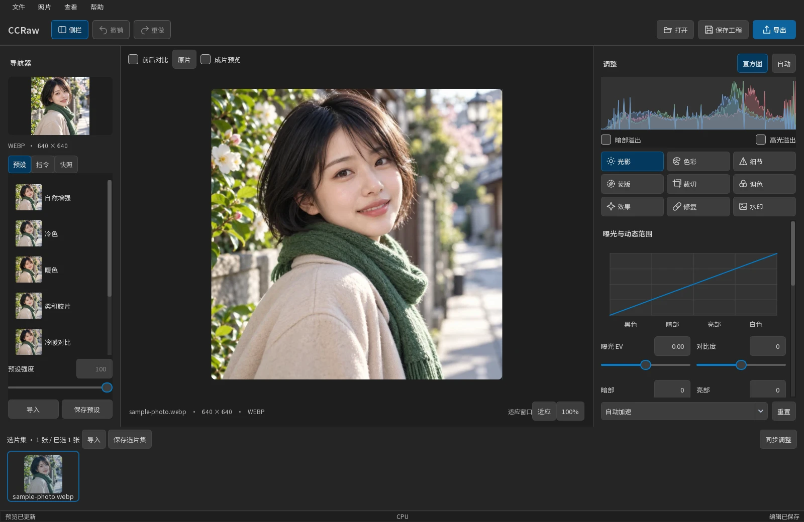
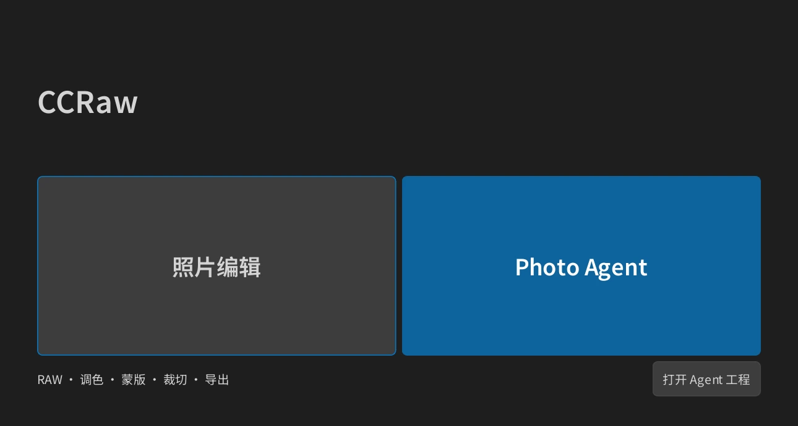
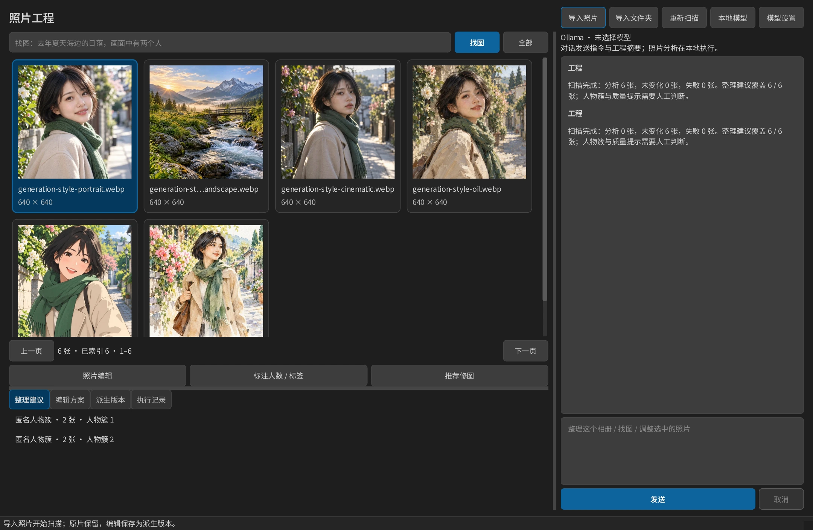
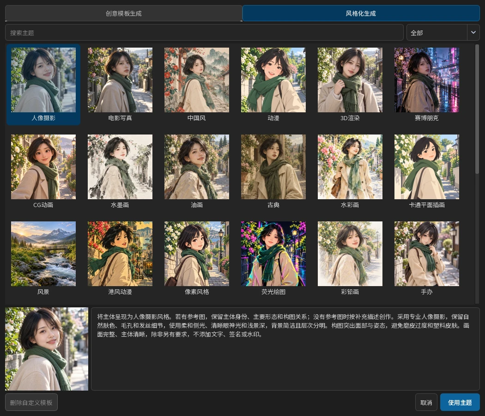
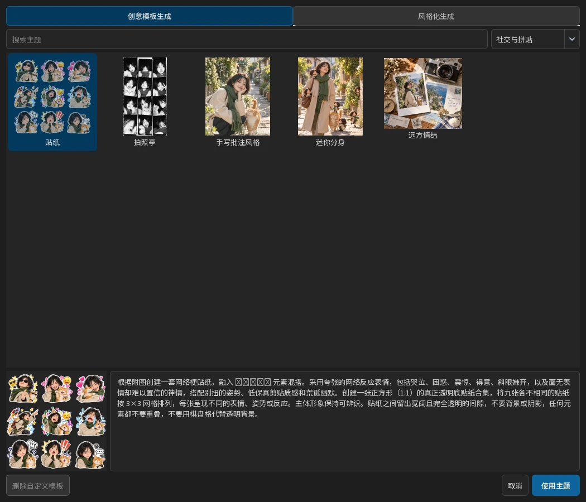
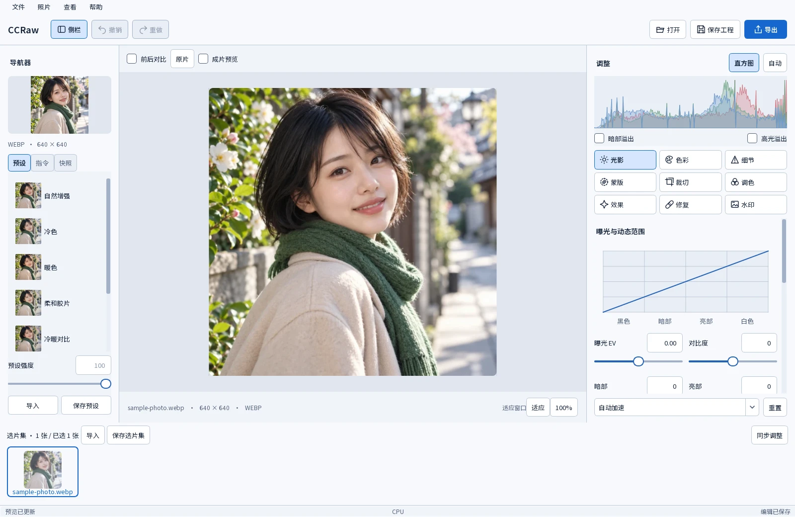

# CCRaw

**面向 Windows 的开源照片编辑与 Photo Agent 软件。**

CCRaw 将照片调整、局部编辑、选片管理和 AI 图像创作放在同一个工作空间。导入原片后，可以实时调整光影与色彩、比较编辑效果、保存工程，再将成片单独导出。原片保持不变，调整可撤销，也可保存为预设应用到其他照片。



## 两种工作空间

启动后选择「照片编辑」或「Photo Agent」。照片编辑保留原有 RAW 调整、选片集、实时预览、蒙版、裁切、指令与生成工作流。Photo Agent 以一个工程管理一组照片，通过本地分析与模型对话完成整理、检索和编辑方案选择。



### Photo Agent

新建 `.ccrawagent` 工程，导入照片或文件夹，即可开始扫描。工程记录原片引用，分析结果、会话和派生版本保存在旁边的 `.ccrawagent-data` 文件夹中。

| 工作 | 结果 |
|---|---|
| 整理 | SHA-256 完全重复组、相似候选、曝光与清晰度提示、按拍摄时间形成的事件、匿名人物簇 |
| 找图 | 将自然语言转为限定条件，组合拍摄日期、文件名、标签、本地 CLIP 向量、人物簇和质量信号 |
| 修图 | 选中照片后先本地诊断，提供最多三种方案；自然语言可创建新的参数方案 |
| 继续编辑 | 直接打开现有照片编辑器，使用完整工具，并将参数保存回 Agent 工程 |
| 外部编辑 | 执行前查看 Provider、模型、上传图片、提示词和费用；结果保存为独立派生版本 |
| 执行记录 | 会话、任务和工具调用持久保存；查看历史不会重新执行请求 |



Agent 默认复用「修图指令」的模型配置，无需维护第二套对话 API Key。对话服务需要支持工具调用；对话只发送指令、有限工程摘要和工具结果，图像分析在本地进行。

没有配置 LLM 时仍可扫描、查看整理建议、使用本地找图和推荐修图。本地语义检索与匿名人物聚类需要点击「本地模型」安装约 186 MiB 的校验模型；模型文件与源码分开保存。

人物检测和聚类属于候选信号。画面人数默认未知，可通过「标注人数 / 标签」核验；严格人数查询排除未知照片。事件依据 EXIF 拍摄时间，缺失时不使用文件修改时间代替。复杂中文找图建议使用 Agent 对话，由模型转成检索条件与英文语义查询。功能边界及工程存储见 [Photo Agent 使用说明](docs/photo-agent.md)。

## 从原片到成片

### 拖动即预览

拖动滑杆、编辑曲线或转动色彩分级色轮时，画面随参数变化更新。适应窗口时查看整体效果，切换到 100% 查看可见区域的原图像素；使用「原片」和「前后对比」检查每一步调整。

图像计算与界面交互分开执行，连续输入会合并处理。CPU 可完成日常编辑，也可按环境启用 DirectML、CUDA 或模型推理加速。实际响应速度取决于照片尺寸、调整类型和设备配置。

### 常用编辑工具集中呈现

| 工具 | 能做什么 |
|---|---|
| 光影 | 曝光、对比度、暗部与亮部、黑白场和曲线调整 |
| 色彩 | 白平衡、HSL 和色彩分级，控制整体色调与局部颜色 |
| 细节 | 锐化、降噪与可选 AI 细节处理 |
| 蒙版 | 局部调整，结合画笔、渐变及可选自动选区 |
| 裁切 | 调整构图和比例；框内拖动保持尺寸，水平或垂直移动取景 |
| 修复与效果 | 修复处理、图像效果和水印 |
| 选片与导出 | 选片集、同步调整、预设、快照和批量导出 |

裁切框画好后，可在框内自由移动；在框外拖动可重新划框。点击「确认裁切」或按 Enter 应用。

### 保存编辑，复用风格

工程保存为 `.ccraw`，选片集保存为 `.ccrawalbum`，预设保存为 `.ccrawpreset`。使用快照保留不同调整方案，再用预设和同步调整统一一组照片的风格。

## 用文字调整和创作

「指令」包含修图与生成两种工作流程。自然语言修图可连接本地模型或云端服务，将描述转为可继续编辑的参数；可选 SenseVoice 模型在本地识别语音。

### 三种图像生成方式

| 模式 | 使用方式 |
|---|---|
| 创意模板生成 | 从 50 个内置主题出发，创作贴纸、拍照亭、微缩模型、漫画、蓝图等图像 |
| 风格化生成 | 从 31 种风格中选择摄影、动漫、绘画、像素、艺术家风格等效果 |
| 自定义生成 | 直接输入自己的提示词，自由设置参考图与生成参数 |


模板支持分类、搜索和效果预览。选中主题后可以继续修改提示词，或保存自己的模板；「清空」重置当前模式的模板选择和提示词。超写实壁纸模板会先让你选择拍摄主体。





主题图片用于展示风格方向，实际生成结果取决于参考图、提示词和所配置的模型。

### 参考图、队列与生成记录

生成支持文生图和图生图。可以选择当前照片作为参考，也可以只使用提示词；每张参考图可生成 1–4 张，队列最多 32 张。结果独立保存，可打开继续编辑或另存为，生成记录可在下次启动后查看。

在生成面板的「设置」中填写 Seedream 或兼容图像生成服务的接口地址、模型和 API Key。生成配置与修图模型分开保存。只有勾选「发送参考图」时才发送经过处理的参考图片；基础照片编辑无需云端服务。服务商可能按请求计费，取消已提交的请求不一定停止服务端处理。

## 选择适合你的外观

浅色为默认外观，也可通过「查看 → 外观」切换到 VS Code 风格的深灰色界面。主题切换只改变界面显示，不改变照片参数或成片颜色。



上述截图来自当前软件实际运行的界面。

## 开始使用

CCRaw 当前及后续发行面向 **Windows 64 位**。源码运行推荐使用 **Python 3.12 64 位**。

在项目目录打开 PowerShell：

```powershell
python -m venv .venv
.\.venv\Scripts\python.exe -m pip install -r requirements.txt
.\.venv\Scripts\python.exe main.py
```

依赖安装后，也可运行 `run-source.cmd`。已经配置好开发环境时，直接执行启动命令即可，无需重新创建环境。

使用 Photo Agent 对话与语义模型，再安装可选依赖：

```powershell
.\.venv\Scripts\python.exe -m pip install -r requirements-agent.txt
```

1. 选择「照片编辑」，点击「打开」导入 RAW 或常见照片文件；或新建 Photo Agent 工程后导入照片。
2. 在右侧选择光影、色彩、蒙版、裁切等工具，实时查看调整效果。
3. 保存工程，或点击「导出」生成成片。
4. 需要文字修图或图像生成时，进入左侧「指令」并配置对应服务。

### 可选运行资源

Git 仓库和 Python 包包含界面、字体与主题预览图；大型 AI 模型和 ExifTool 通过独立资源包提供。基础编辑可以先使用，启用相关模型功能时再安装资源。

从 [运行资源下载页](https://github.com/wamellia/CCRaw/releases/tag/runtime-assets) 下载 `CCRaw-0.1.0-RuntimeAssets.zip`，在项目目录执行：

```powershell
.\.venv\Scripts\python.exe tools/fetch_assets.py --archive "C:\path\CCRaw-0.1.0-RuntimeAssets.zip"
```

将示例路径替换为实际下载位置。完整离线交付目录已包含运行资源时，无需重复安装。模型用途与许可见 [模型资源说明](MODEL.md)。

### 可选 GPU 加速

默认依赖提供 CPU 运行环境。Windows GPU 环境可选择 `requirements-directml.txt`，NVIDIA CUDA 环境可选择 `requirements-gpu.txt`。安装前按相应文件中的说明移除其他 ONNX Runtime 发行包，每个环境只保留一种；具体驱动与系统要求见依赖文件和 [构建说明](docs/releasing.md)。

## 数据与开源

照片编辑在本地完成，CCRaw 不会自动上传照片、日志或遥测数据。自然语言和图像生成按你配置的服务发送请求，API Key 使用 Windows DPAPI 保护，并与源码分开保存。详情见 [隐私说明](docs/privacy.md)。

源码采用 MIT 许可。原项目、字体、模型和第三方依赖的署名与许可保留在 [LICENSE](LICENSE)、[NOTICE](NOTICE)、[第三方依赖](THIRD_PARTY.md) 及对应资源许可中。

[开发与检查](CONTRIBUTING.md) · [模块结构](docs/architecture.md) · [Windows 构建](docs/releasing.md)
