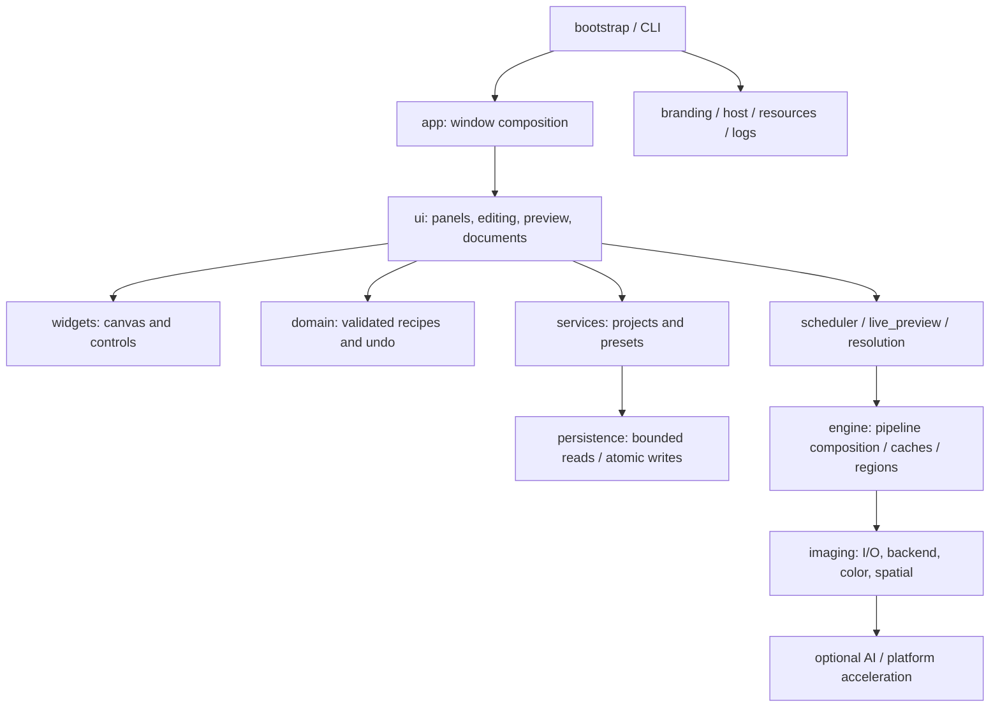

# Architecture

Windows Qt desktop application. `app` composes document, preview, adjustment, workspace and platform services. Image processing supports CPU, DirectML and optional CUDA; model sessions can also use TensorRT.

The public model and engine modules are stable facades. The image pipeline retains dynamic public hooks used by optional backends and tests. Pixel operators use float32 analytical formulas; curves retain their float64 interpolation. Native parallel kernels disable fastmath and use bounded threads.

Preview input is coalesced. The GUI owns edit state and QPixmap; the single image worker owns immutable snapshots, image processing, histogram/overlay preparation and QImage conversion. Epoch and document tokens reject incompatible old results. Fit view keeps the standard preview resolution; zoomed rendering evaluates visible original-pixel regions with neighborhood margins and global effect coordinates.

Resource resolution supports CCRAW_ASSET_DIR, frozen bundled assets, source assets and installed package resources. CCRAW_DATA_DIR / CCRAW_CACHE_DIR allow independent deployment and tests. Windows defaults use `%LOCALAPPDATA%/CCRaw` for application data and its `cache` and `logs` subfolders.

Project, preset and album saves use same-directory temporary files and atomic replacement. Existing files survive a failed replacement. Legacy identifiers/extensions are read explicitly; new writes use CCRaw identifiers without changing the validated recipe schema solely for branding.

Feature-specific modules retain image stacking, selection, restoration, speech and optional model services. They remain optional computations behind the same scheduler and CPU fallback rather than a new network dependency for normal editing.

`photo_agent/ui.py` adds a launcher and a separate project workspace without changing the catalog window composition. A cancellable Qt worker owns each Agent job; GUI state and QPixmap remain on the GUI thread. The editor bridge restores validated per-photo recipes and explicitly saves them back into the Agent project.

`photo_agent/store.py` owns SQLite transactions and portable project manifests. Photo facts, preferences, messages, jobs and runtime events use separate tables. `analysis.py` implements incremental scan → analysis → index; `search.py` validates allowlisted metadata constraints before bounded hybrid ranking. `models.py` loads verified local CLIP and face models lazily. This maps DeepTutor's ingestion/retrieval abstraction to photos without importing its teaching business or runtime.

`runtime.py` hosts nanobot-ai 0.3.5's existing AgentLoop, Request Context, Runtime Context Provider, hooks and events. It replaces default tool registration with a photo-only registry, preserves the upstream loop, and supplies bounded project context. `plugins.py` separates declarative capabilities from tools and checks ownership during registration, applying the explicit plugin composition idea from deepseek-harness without adding its TypeScript runtime. Shell, web, file, subagent and payment execution tools are not registered.

`editing.py` separates editable proposals from execution. Local edits use the existing full-resolution engine; external proposals freeze the JPEG reference and hash provider settings, disclosure and source. Only the GUI invokes execution after confirmation. Atomic single-use claims, restart interruption and independently recorded derived files prevent automatic paid replay.

`generation_panel` adds template browsing and a bounded serial queue under the instruction page. `image_generation` prepares immutable edited references, sends cancellable HTTP requests, validates complete output images, and commits independent results with SQLite task history in per-user storage. Settings snapshots stay in memory; credentials never enter task records. Restart cancels interrupted tasks instead of resubmitting paid requests. Network generation does not occupy the editing scheduler.

`ui/theme.py` owns light/dark tokens and the Qt palette. Custom painters read the current widget palette; theme changes do not modify image recipes or preview pixels. `workspace.py` contains presets, snapshots and grading; `editing_tools.py` contains camera white balance and retouch controls.
