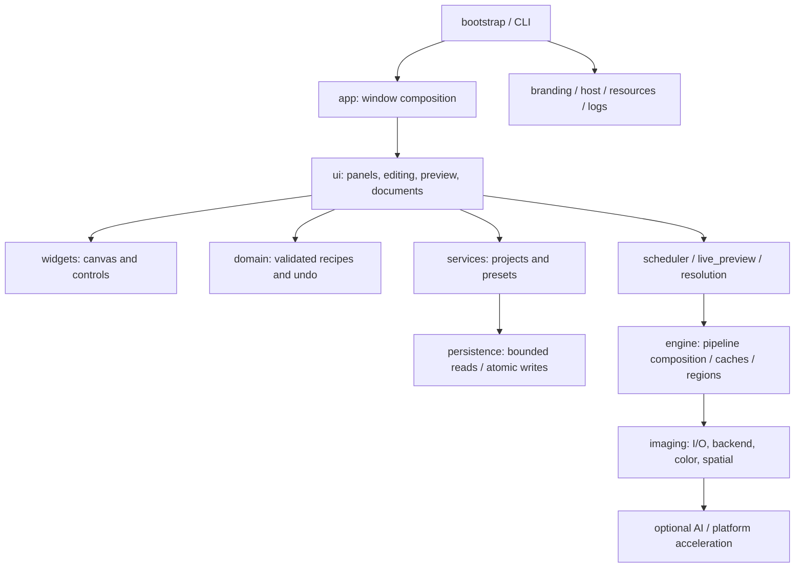

# Architecture

Qt desktop application. `app` composes document, preview, adjustment, workspace and platform services.

The public model and engine modules are stable facades. The image pipeline retains dynamic public hooks used by optional backends and tests. Pixel operators use float32 analytical formulas; curves retain their float64 interpolation. Native parallel kernels disable fastmath and use bounded threads.

Preview input is coalesced. The GUI owns edit state and QPixmap; the single image worker owns immutable snapshots, image processing, histogram/overlay preparation and QImage conversion. Epoch and document tokens reject incompatible old results. Fit view keeps the standard preview resolution; zoomed rendering evaluates visible original-pixel regions with neighborhood margins and global effect coordinates.

Resource resolution supports CCRAW_ASSET_DIR, frozen bundled assets, source assets and installed package resources. CCRAW_DATA_DIR / CCRAW_CACHE_DIR allow independent deployment and tests. Normal platform defaults use CCRaw's own per-user namespace.

Project, preset and album saves use same-directory temporary files and atomic replacement. Existing files survive a failed replacement. Legacy identifiers/extensions are read explicitly; new writes use CCRaw identifiers without changing the validated recipe schema solely for branding.

Feature-specific modules retain image stacking, selection, restoration, speech and optional model services. They remain optional computations behind the same scheduler and CPU fallback rather than a new network dependency for normal editing.

`generation_panel` adds template browsing and a bounded serial queue under the instruction page. `image_generation` prepares immutable edited references, sends cancellable HTTP requests, validates complete output images, and commits independent results with SQLite task history in per-user storage. Settings snapshots stay in memory; credentials never enter task records. Restart cancels interrupted tasks instead of resubmitting paid requests. Network generation does not occupy the editing scheduler.

`ui/theme.py` owns light/dark tokens and the Qt palette. Custom painters read the current widget palette; theme changes do not modify image recipes or preview pixels. `workspace.py` contains presets, snapshots and grading; `editing_tools.py` contains camera white balance and retouch controls.
